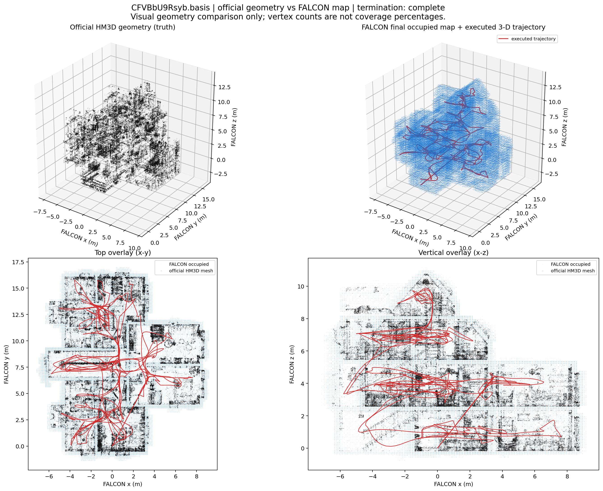
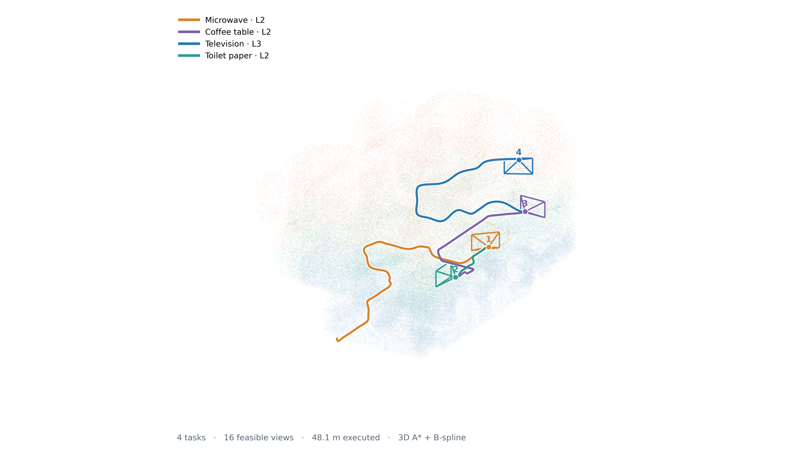
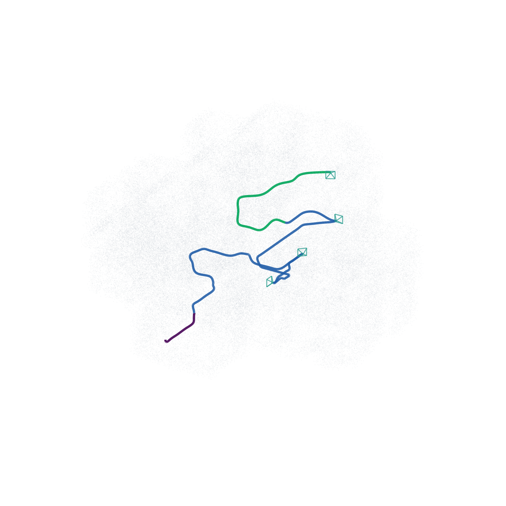
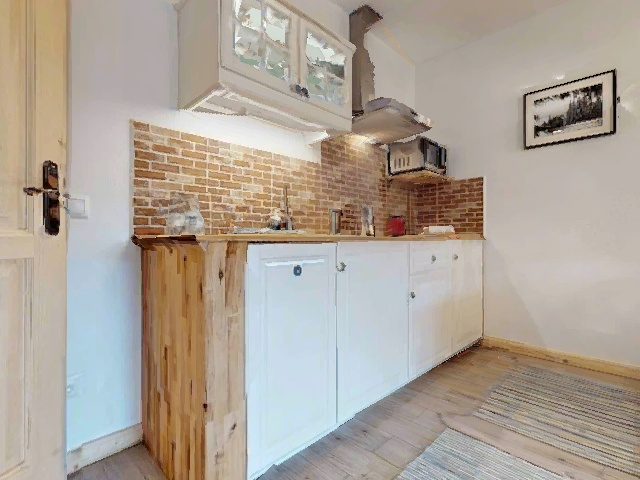

# 00337 原始图像素材

本目录集中保存论文制图所依赖的原始图片副本，不包含脚本、JSON、点云、Bag 或已拼版的 System Overview。

这些文件被放在 Git 可跟踪的 `docs/assets/system_overview/` 下，方便协作者 clone 后直接浏览和复用。HM3D 场景相关素材仍应遵守数据集许可证，仅用于本项目研究展示。

## 快速预览

### 第一阶段

| 三维探索覆盖 | 多楼层房间分割 | 房间语义 |
|---|---|---|
|  |  |  |

### 第二阶段

| 三维联合规划 | 跨层轨迹与视锥 | 终端 RGB |
|---|---|---|
|  |  |  |

## 目录

- `official_scene/`：HM3D 官方 00337 场景图和楼层俯视图；
- `stage1/`：探索覆盖对比、逐层投影、墙体诊断、跨层通道、房间分割和房间语义原始输出；
- `stage2/keyframes/four_task/`：四任务的 4 张独立终端关键帧；
- `stage2/keyframes/recovery/`：主动恢复过程中依次访问的 7 张终端关键帧；
- `stage2/trajectory_figures/`：任务执行总览、跨层轨迹、观察视锥、联合路径、高度曲线和 B-spline 跨层验证图。

Stage2 只保留画图需要的终端/恢复关键帧，不复制上千张连续 RGB。关键帧均为 Habitat 原始 `640×480` 渲染结果；这里没有进行超分辨率、插值放大、框图拼版或颜色重绘。所有文件都是副本，原始运行目录保持不变。

`trajectory_figures/` 中部分图片是在真实轨迹、候选位姿和地图数据上生成的论文可视化，并非相机原始帧；因此与 `keyframes/` 分开保存。

来源：

```text
outputs/stage1_3d/00337-CFVBbU9Rsyb/dormant_recovery_20260829/
outputs/wall_extraction/00337_dormant_recovery_ceiling_clearance_L1-L3/
outputs/room_pipeline/00337_transition_aware_geometry_v1/
outputs/room_pipeline/00337_transition_aware_qwen_v1/
outputs/stage2_3d/tasks/00337_all_found_showcase_v1_20260830/
outputs/stage2_3d/tasks/00337_toilet_paper_real_recovery_v4_20260831/
```
