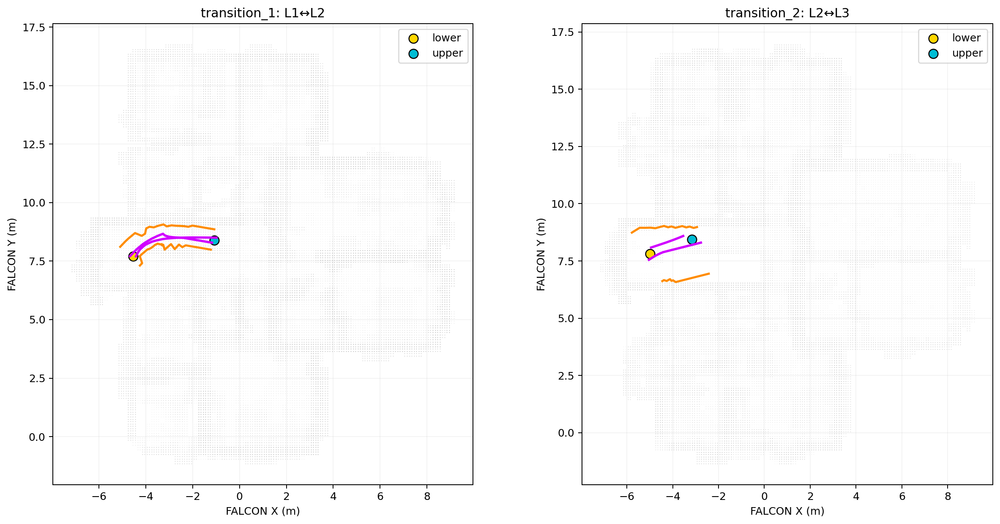
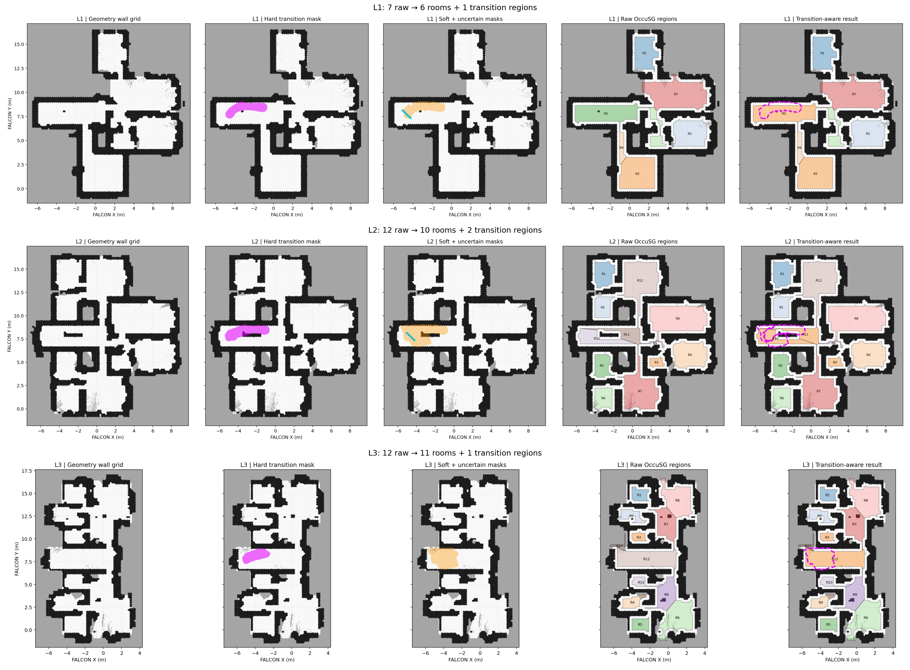
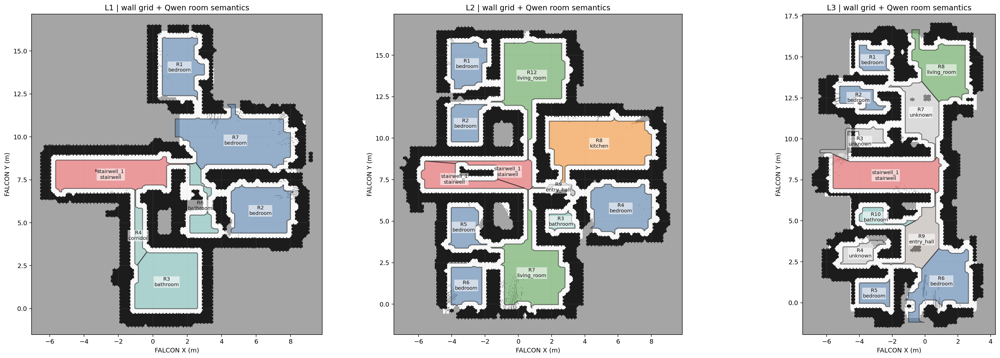

# 跨层通道重建

`scripts/reconstruct_transition_spaces.py` 从 FALCON 自身保存的轨迹、occupied 点云和 free 点云离线重建跨层通道候选。模块不读取 HM3D 真值、navmesh、语义标签或场景编号，也不修改在线探索和 OccuSG 输入。

## 处理过程

1. 从轨迹停留高度和 occupied 水平面推断楼层；
2. 检测“稳定离开下层、连续跨越分界、稳定进入上层”的真实换层轨迹；
3. 将同一楼层对、相近交点的往返轨迹聚合成一个 transition space；
4. 沿轨迹建立分段局部坐标系，计算垂直于轨迹的 FREE 横截面；
5. 用垂直连续的 OCCUPIED 点估计两侧墙界，没有墙证据的一侧保留为 uncertain；
6. 使用上下层地板开口证据判断推断边界是否可以闭合。

输出位于运行目录下的 `transition_reconstruction/`：

- `transitions.json`：楼层连接、双入口、中心线、局部截面、置信度和边界状态；
- `transition_points.pcd`：局部裁剪后的过渡结构点；
- `observed_free.pcd`：轨迹走廊内实际观测的 FREE 点；
- `transition_diagnostic.png`：俯视离线诊断图。

`boundary_closed=false` 表示现有观测不足以唯一确定完整楼梯间，不能把 uncertain 边界当成真值墙面。

## 使用

原有可视化命令不变，启动前会自动重建：

~~~bash
./scripts/view_floor_boxes.sh \
  outputs/stage1_3d/<scene-id>/<run-name> \
  outputs/boxer/<box-run>/episode/<vocab>_3dbbs_fused.csv \
  0 3
~~~

RViz 新增两个独立且可关闭的显示项：

- `Transition Structure Points`：亮橙色局部结构点云；
- `Transition Reconstruction`：品红轨迹核心、黄/青双入口、橙色已观测边界、灰色 uncertain 边界。

当前分类 `stair_candidate` 只表示换层轨迹具有明显水平位移，不等同于已经从点云逐级识别出台阶。模块稳定前不应将其直接写入 OccuSG。

## Transition-aware 房间分割

下面的离线流水线不会改写几何墙图，也不会修改 OccuSG。它先生成每层 hard/soft/uncertain mask，让 OccuSG 正常分割，再根据 mask 与原始 region 的重叠关系将楼梯区域标为 `transition_space`：

~~~bash
.envs/habitat/bin/python scripts/run_transition_room_pipeline.py \
  <run-dir> <geometry-wall-grid-dir> <output-dir> \
  --max-floor 3 --decomp-threshold 1.8
~~~

每层输出：

- `L*_transition_hard.npy`：真实换层轨迹走廊和双入口；
- `L*_transition_soft.npy`：局部截面重建范围；
- `L*_transition_uncertain.npy`：缺少墙面或开口支持的边界；
- `L*_regions_raw.json`：未经修改的 OccuSG 输出副本；
- `L*_regions_transition_aware.json`：只做角色标注后的结果；
- `L*_transition_room_diagnostic.png`：墙图、三种 mask、原始分割与后处理结果五联图；
- `all_floors_transition_room_summary.png`：所有楼层汇总图。

后处理不会把 soft 或 uncertain mask 写成 occupied/free。只有面积受限、并与 hard/soft mask 达到重叠条件的 OccuSG region 才会整体标为 transition，普通房间的几何保持不变。

## 00337 阶段结果

仓库只保留少量用于复现和审查的结果图；Bag、点云、NumPy mask、API 缓存和完整 `outputs/` 仍不进入 Git。

### 跨层通道重建

### Transition-aware OccuSG 房间分割

### 墙体栅格与 Qwen 房间语义

